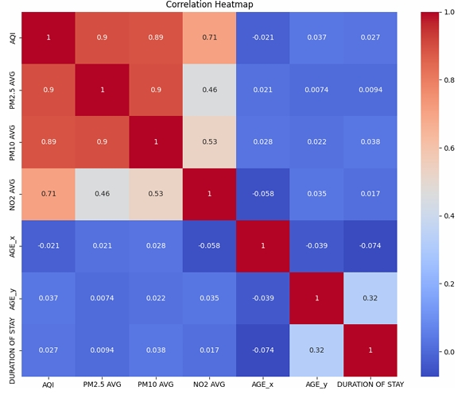
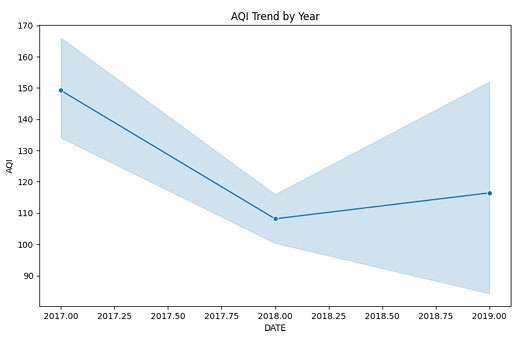
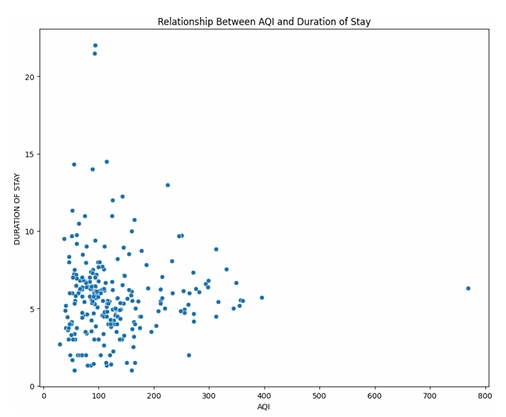

# Air Quality, Demographics, and Hospital Admissions in Punjab, India

An integrated data science project that analyzes how air quality fluctuations and demographic factors correlate with hospital admission durations in the Punjab region. The study includes statistical modeling, visualization, and a machine learning pipeline to explore environmental health impacts.

<br><br>

## 📌 Project Overview

India has the world's highest pollution-related death toll. This project investigates whether air pollution factors (e.g., AQI, PM2.5, PM10) and demographics (e.g., age, gender) influence hospital stay durations. Using real data from Ludhiana, Punjab and various modeling techniques, we aim to explore both linear and nonlinear predictors of hospital admissions.

<br><br>


## 🧠 Hypothesis

We hypothesized that air pollution metrics (AQI, PM2.5, PM10) and demographic attributes such as patient age would be significant predictors of hospital stay duration for respiratory illnesses in Punjab, India.

<br><br>


## 🗂️ Dataset Details

Cleaned and merged from multiple sources (pollution data, hospital admission logs, mortality data), our final dataset includes the following columns:

| Column             | Description                                                |
|--------------------|------------------------------------------------------------|
| Date               | Date of measurement and hospital admission data           |
| AQI                | Air Quality Index                                          |
| PM2.5, PM10, NO2   | Common pollutants in the air                               |
| NH3, SO2, CO, O3   | Additional pollutant measures                              |
| Age_x, Gender_x    | Mortality demographics                                     |
| Age_y, Gender      | Hospital admission demographics                            |
| Duration of Stay   | Target variable: length of hospital stay (in days)         |

<br><br>


## 🔬 Methods

We used a combination of regression-based models to predict hospital stay duration:

- **Linear Regression**: Baseline model
- **Random Forest Regressor**: Captures non-linear relationships
- **Tuned Random Forest**: Improved hyperparameters
- **Cross-validation**: 5-fold to ensure stable performance

### 📈 Model Results

| Model                | MSE     | R² Score |
|----------------------|---------|------------|
| Linear Regression    | 4.8457  | -0.0450    |
| Random Forest        | 3.0955  | 0.3324     |
| Tuned Random Forest  | 3.1022  | 0.3310     |

> Random Forest performed best, but still with modest predictive power.

<br><br>


## 📊 Key Findings

### 🔗 Correlation Insights

- **Strong correlations** between AQI, PM2.5, and PM10 (coefficients ~0.9)
- **AGE_y and Duration**: Moderate positive correlation (0.32)
- **Gender**: Minimal effect on hospital stay duration

<p align="center">
  
</p>

### 🔍 Feature Importance

- **AGE_y (Patient Age)** was by far the most important variable (~50% importance)
- Pollution features were surprisingly less significant (<10%)

<p align="center">
  
</p>

### 📉 Scatter and Trend Plots

- AQI vs. Duration: Loose distribution, suggesting weak predictive ability
- Mean AQI dropped ~40 units between 2017 and 2019

<p align="center">
  
  
</p>

### 📐 Model Performance Limitations

- Best R² = 0.3324 → substantial error remains
- Likely causes: Missing patient history, hospital capacity, diagnosis data

<br><br>


## 🖼️ Presentation Highlights

We presented the findings in a comprehensive slide deck. Some key visual slides include:

<p align="center">
  
  
  
  
</p>

> 📄 [Download the full presentation slides](./Group10_Presentation.pdf)

<br><br>


## 🚧 Study Limitations

- Lack of patient-level medical history or diagnosis codes
- No socioeconomic or economic data (e.g., GDP)
- Overlapping, highly correlated air metrics (multicollinearity)
- Time alignment issues between health and pollution data

<br><br>


## 🔭 Future Work

- Use **mortality rates** as target variable for deeper insights
- Perform **age-stratified** analysis
- Integrate **economic indicators** like GDP and insurance access
- Apply **time series** modeling to capture environmental fluctuations
- Collect more granular and **longitudinal patient data**

<br><br>


## 📜 References

1. Hayward, Ed. "The Human Toll of Air Pollution in India." Boston College, 2021.  
2. AirNow.gov. "Air Quality Index (AQI) Basics."  
3. Bollepalli, Sandeep C., et al. *Diagnostics*, vol. 12, no. 2, 2022.  
4. Hero DMC Heart Institute, Punjab.  

<br><br>


## 📁 Repository Structure

```
Group10_AirQuality/
├── data/                   # Cleaned datasets (not shared)
├── Screenshots/           # All graphs and presentation slide captures
├── Group10_Presentation.pdf
├── Group10_Report.pdf
└── README.md
```

<br><br>


## 📄 License

This project is for educational and research purposes only. All rights to datasets belong to their original publishers. No redistribution of data is allowed.
